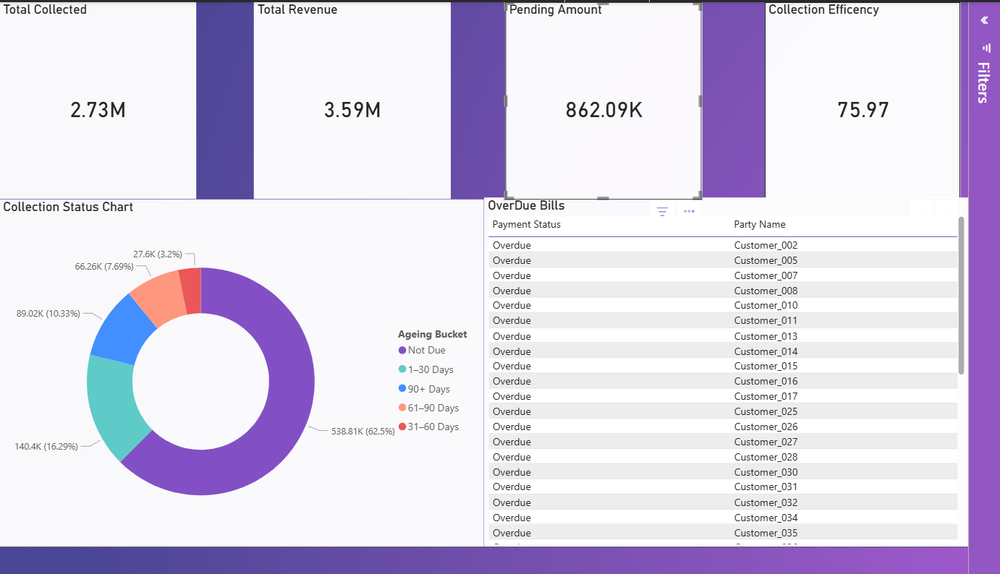
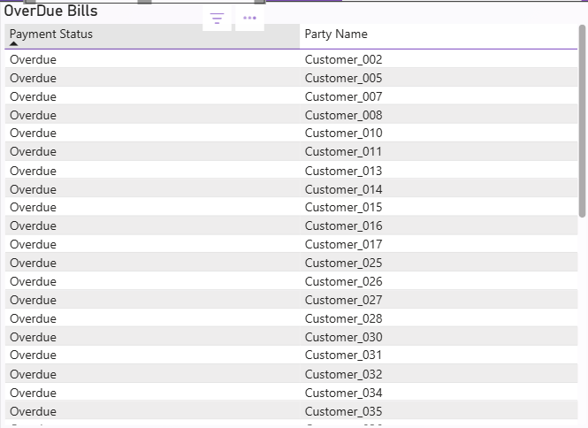
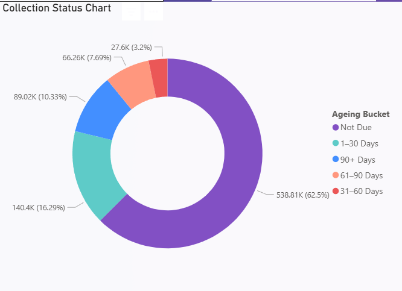

# Clinic Sales Power BI Dashboard

## Overview
This repository contains screenshots of an interactive Power BI dashboard built
using anonymized dummy clinic sales data.

The dashboard visualizes revenue, cash collection, pending payments, overdue
invoices, and ageing analysis.

## Dashboard Features
- Revenue & collection KPIs
- Invoice distribution by collection status
- Ageing analysis of outstanding balances
- Interactive slicers with controlled visual interactions

## Dashboard Screenshots

### Dashboard Overview

### Overdue Analysis

### Ageing Analysis

## Data Privacy
No real patient, clinic, or financial data is shared.
All visuals are generated using anonymized dummy data.
